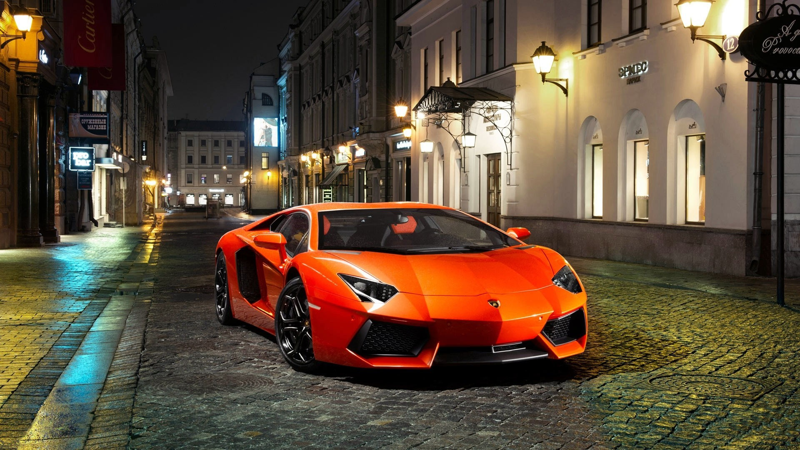
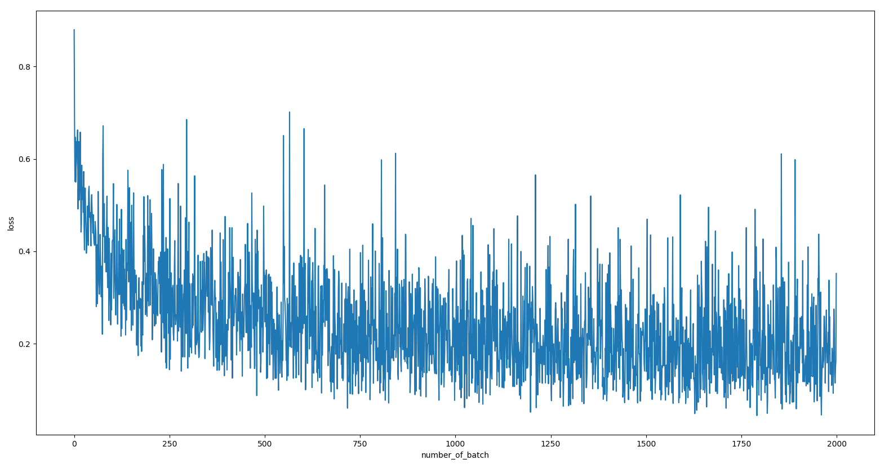

# Computer Vision Projects

### [NO.1  Car Project](https://github.com/LonelySqrt/ComputerVisionProjects/blob/master/car_project) : This project is my first deep learning project about car detection. 

   

### UPDATES:

### 2018-04-25  
* update **car_detection_v2**. 10 epochs get **92.34%** accuracy on training data and **91.63%** accuracy on testing data.

   

### 2018-04-21  
* update **car_detection_v1.** 10 epoches get **86.0%** accuracy. (1000 mini-batch)**

   

### 2018-04-05  
* Create **car project** : The first version of this project is a plain CNN model without any deep learning framework. Just only by `numpy`.

