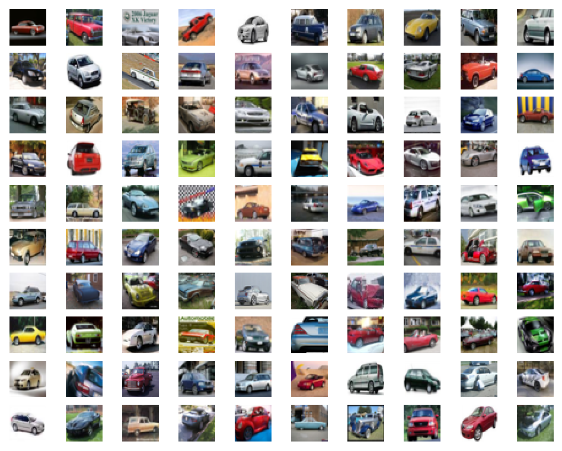
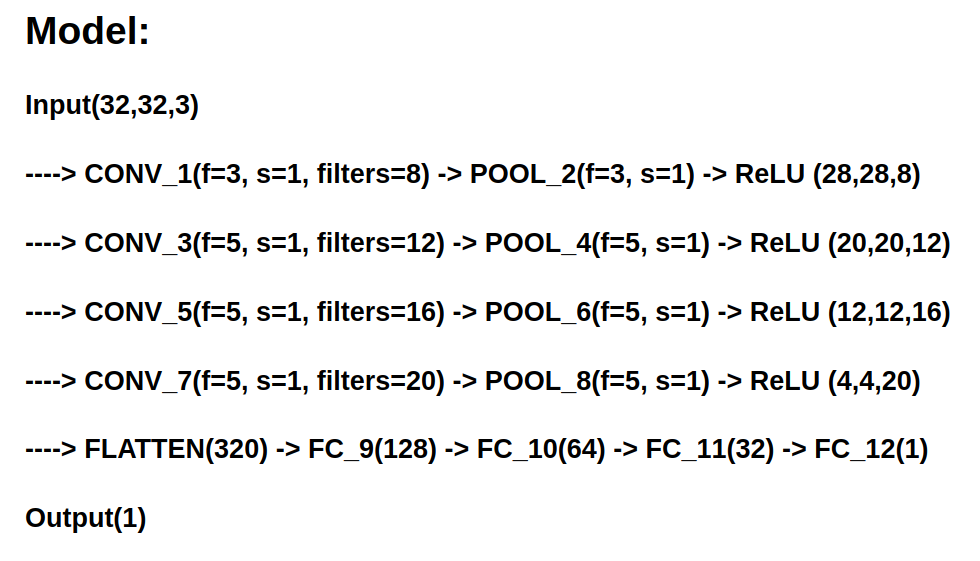

# Car Detection

### `car_detection_v1.ipynb` : the simplest plain **CNN** model on ** [CIFAR-10](https://www.cs.toronto.edu/~kriz/cifar.html) datasets **.  

* data : the **positive** and **negative** images are both **6000**. The shape of image is **(32,32,3)**.  

                

* model : input --> (conv->avg_pool->relu) x 4 --> (nn->relu) x 3 --> (nn->sigmoid) --> output.

                

* costs
