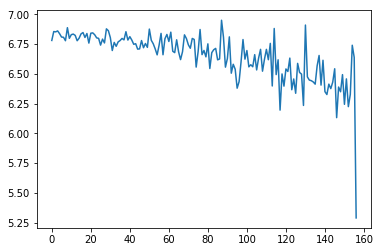
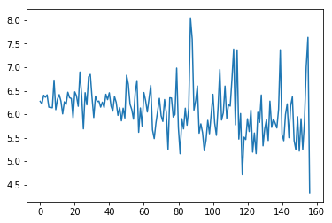

# Car Detection

### `car_detection_v1.ipynb` : the simplest plain CNN model on [CIFAR-10](https://www.cs.toronto.edu/~kriz/cifar.html) datasets.  

* data : the **positive** and **negative** images are both **6000**. The shape of image is **(32,32,3)**. Batch size is **64**.  

                

* model : input --> (conv->avg_pool->relu) **x 4** --> (nn->relu) **x 3** --> (nn->sigmoid) --> output.

                

* costs : **third** epcho(left) and **fourth** epoch(right)

  
  

