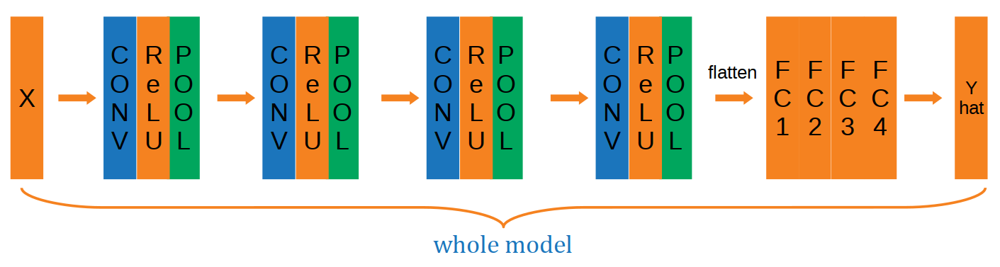

# Car Detection

### `car_detection_v1.ipynb` : the simplest plain CNN model on [CIFAR-10](https://www.cs.toronto.edu/~kriz/cifar.html) datasets.  

* data : the **positive** and **negative** images are **both 6000**. The shape of image is **(32,32,3)**. Batch size is **64**.  

               

----

* conv-block : 

                

* model :

                

----

* cost : the **first** epoch. **NOTE THAT: I haven't added any normalization yet.** 

  

  
 Generally you could see the cost is descenting slowly, and there is a lot <strong>oscillation</strong> because of mini-batch. 

